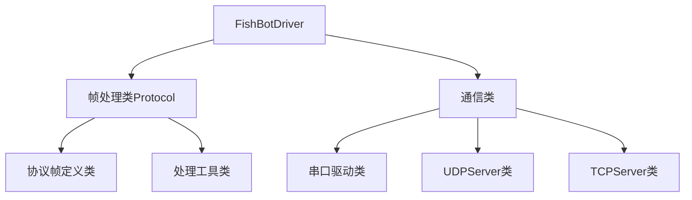

# FishBot DRIVER

采用C++作为核心语言，对Python进行二次的封装，同时支持对Android、Rust等进行二次封装DRIVER。

## 编译与安装

```
sudo apt install libboost-dev libgtest-dev
```

## 工程结构设计

总体架构



### FishBotDriver

- 对外表现形式：动态链接库-libfishbot_driver.so
- 提供接口类：FishBotDriver
- 提供初始化方法：init(配置参数或者~~配置文件地址~~)
- 提供获取数据回调函数：odomCallback\imuCallback
- 提供数据发送方法：sendSpeed
- 提供数据处理方法（考虑插件形式）：EKF融合里程计和IMU

## 任务列表

- [x] 搭建框架
- [x] 完成串口驱动类编写
- [x] 定义帧数据
- [x] 编写帧处理工具
- [x] 完成编码器数据解析
- [x] 完成速度数据发送
- [ ] 完成UDPServer驱动类编写
- [ ] 完成速度计算
- [ ] 完成里程计推算

## 问题讨论

- 如何实现多机控制支持（机器人端是否需要设计一个ID号，这样即使走不同的通讯也可以匹配上机器人）
